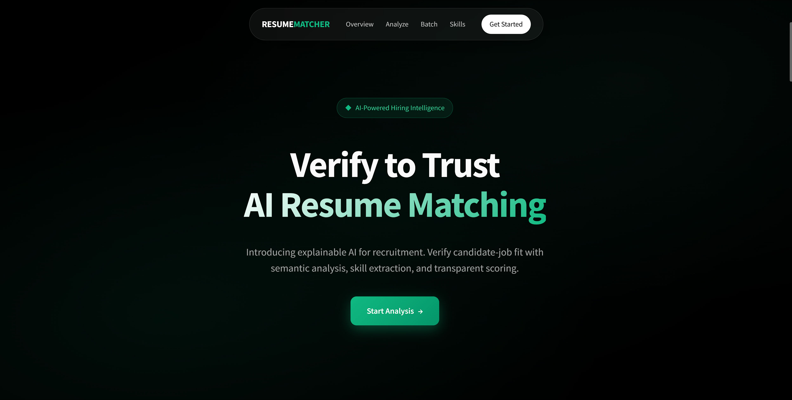
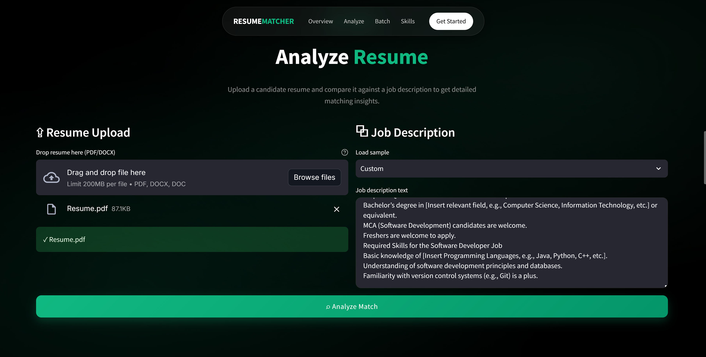
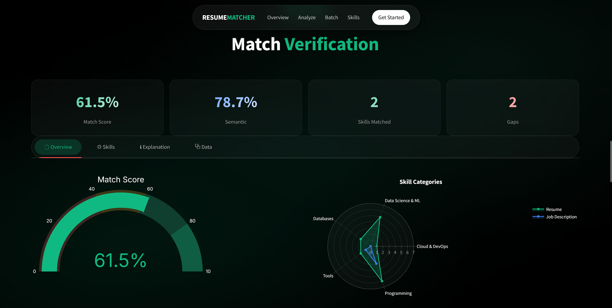
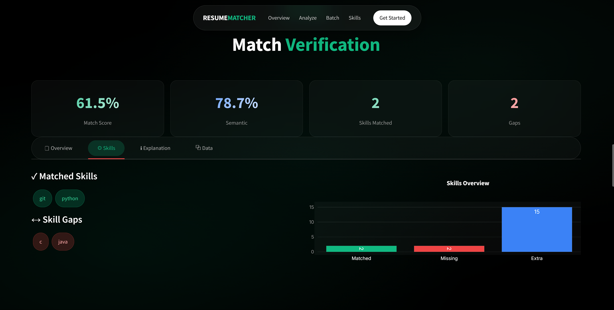
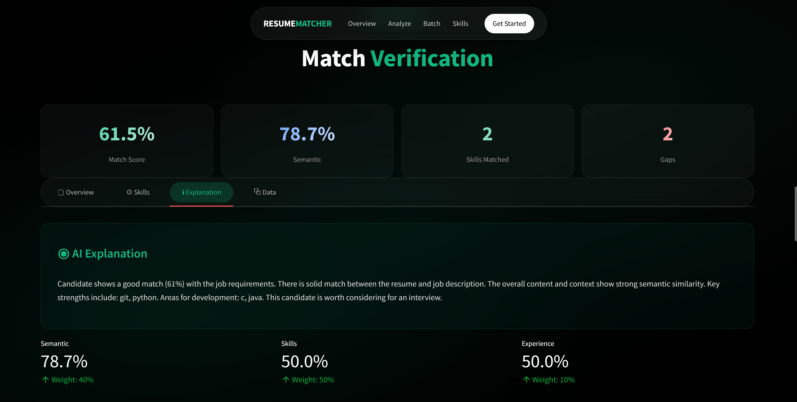
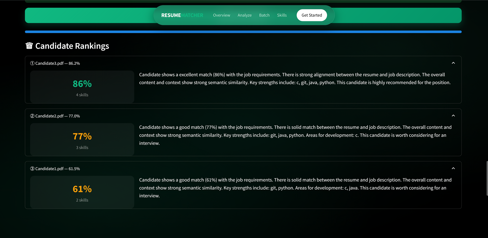
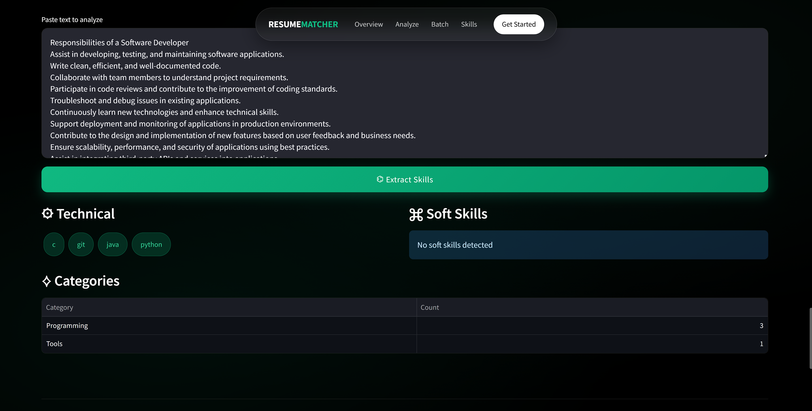
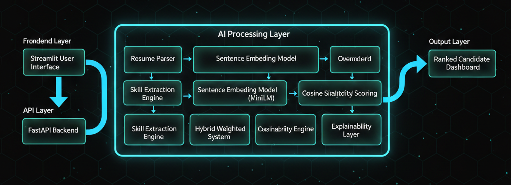
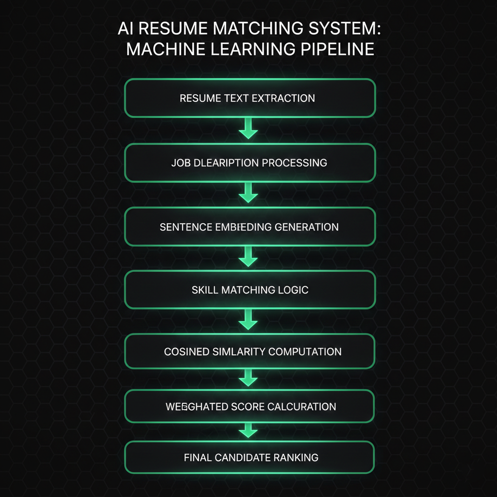

# AI Resume Intelligence Platform  
### Explainable Hybrid NLP System for Intelligent Candidate–Job Matching

An end-to-end AI-powered hiring intelligence platform combining transformer-based semantic similarity with structured skill intelligence and interpretable scoring mechanisms.

---

# 🚀 Product Vision

Traditional ATS systems rely on brittle keyword matching, ignoring contextual and semantic alignment between resumes and job descriptions.

This platform introduces a hybrid scoring pipeline that combines:

- Transformer-based contextual embeddings  
- Structured skill extraction  
- Weighted multi-signal scoring  
- Explainable reasoning generation  
- Batch candidate ranking  
- Interactive visualization dashboard  

---

# 🖥️ Product Interface Walkthrough

## 1️⃣ Landing – Hero Section


---

## 2️⃣ Resume Analysis – Upload & Job Description


---

## 3️⃣ Match Verification – Deep Breakdown

### 🔎 Overview


### 🧠 Skills Analysis


### 💬 AI Explanation


---

## 4️⃣ Batch Candidate Ranking


---

## 5️⃣ Skill Extraction Engine


---

# 🏗️ System Architecture



### Architecture Flow

Resume → Parser → Skill Extractor → Embedding Model → Similarity Engine → Hybrid Scoring → Explanation → Dashboard

---

# 🔬 Machine Learning Pipeline



### Pipeline Steps

1. Resume Text Extraction  
2. Job Description Processing  
3. Sentence Embedding Generation  
4. Skill Matching  
5. Cosine Similarity Computation  
6. Weighted Score Calculation  
7. Explanation Generation  
8. Ranking Output  

---

# ⚙️ Technology Stack

| Layer          | Technology |
|---------------|------------|
| NLP Model     | SentenceTransformers (MiniLM) |
| Backend       | FastAPI |
| Frontend      | Streamlit |
| Visualization | Plotly |
| Parsing       | PyPDF2, python-docx |
| ML Utilities  | scikit-learn |
| Data Handling | Pandas |

---

# ⚙️ Installation

```bash
git clone https://github.com/arsonic-dev/ai-resume-intelligence.git
cd ai-resume-intelligence

python -m venv venv
venv\Scripts\activate   # Windows

pip install -r requirements.txt
```

---

# 📁 Project Structure

ai-resume-intelligence/
├── backend/
├── frontend/
├── assets/
│   ├── screenshots/
│   └── architecture/
├── requirements.txt
└── README.md

---

# 🔮 Roadmap

- Cross-encoder re-ranking stage
- Fairness-aware evaluation metrics
- Dockerized deployment
- CI/CD integration
- Production cloud deployment

---

# 👤 Author

Ankit Kumar  
AI / ML Engineer  

Gmail: kumarankit9065@gmail.com
LinkedIn: https://linkedin.com/in/ankit-kumar-btech-cse/  
GitHub: https://github.com/arsonic-dev  
